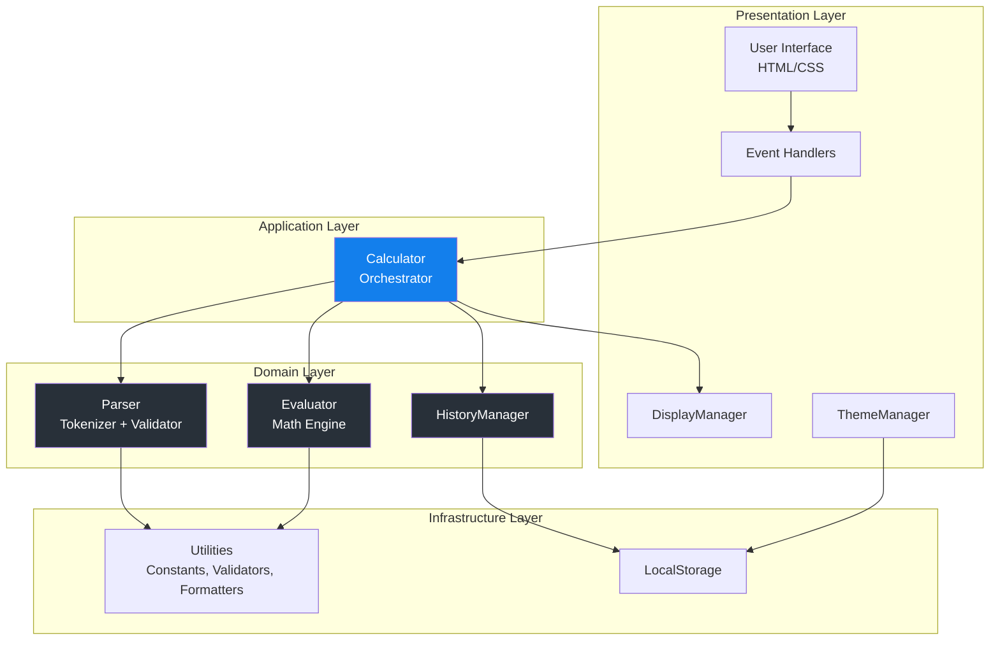
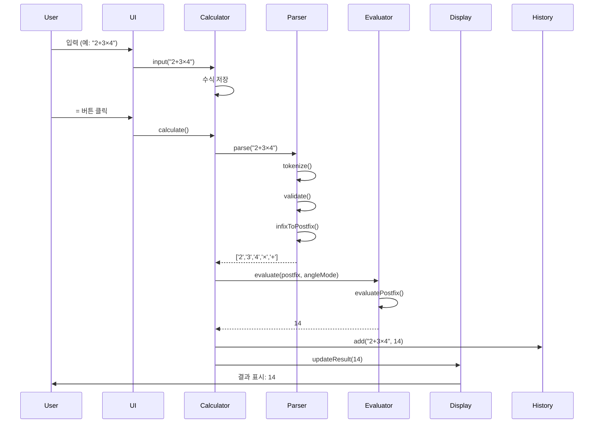
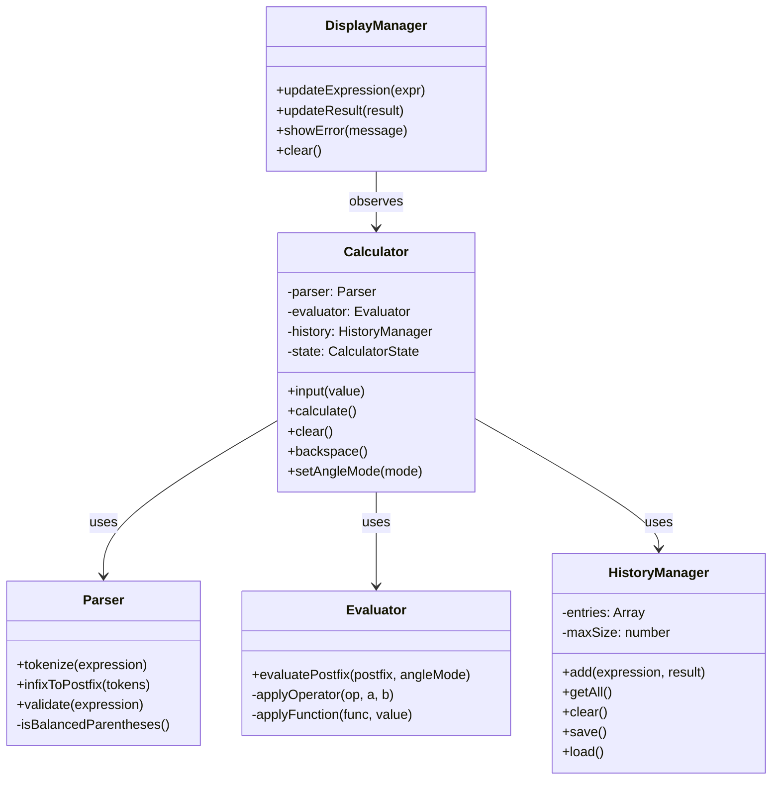
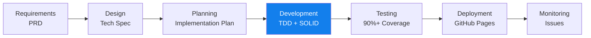

# 🧮 Scientific Calculator

> **A modern, mobile-first scientific calculator built with Test-Driven Development and SOLID principles**

[](https://chlsuun.github.io/calculiator-demo-/)
[](https://github.com/chlsuun/calculiator-demo-/issues)
[](https://github.com/chlsuun/calculiator-demo-)
[](LICENSE)

[**Live Demo**](https://chlsuun.github.io/calculiator-demo-/) | [**Documentation**](./document/) | [**Issues**](https://github.com/chlsuun/calculiator-demo-/issues)

---

## 📌 프로젝트 개요

이 프로젝트는 **현대적인 소프트웨어 엔지니어링 원칙**을 적용하여 구축한 웹 기반 공학용 계산기입니다. 단순한 계산기 구현을 넘어, **Test-Driven Development(TDD)**, **SOLID 원칙**, **Clean Architecture**를 실무 수준으로 적용한 포트폴리오 프로젝트입니다.

### 🎯 프로젝트 목표

- ✅ **TDD 방법론 실습**: 코어 로직 90% 이상 테스트 커버리지 달성
- ✅ **SOLID 원칙 적용**: 유지보수 가능하고 확장 가능한 아키텍처 설계
- ✅ **Clean Code**: 가독성 높고 문서화된 코드 작성
- ✅ **모던 웹 기술**: ES6+, Tailwind CSS, GitHub Actions CI/CD
- ✅ **접근성**: WCAG AA 준수, 키보드 네비게이션, 스크린 리더 지원

---

## ✨ 주요 기능

### 🔢 계산 기능
- **기본 연산**: 사칙연산 (+, -, ×, ÷)
- **과학 함수**: 삼각함수 (sin, cos, tan), 로그 (log, ln)
- **고급 연산**: 거듭제곱 (x^y), 제곱근 (√), 팩토리얼 (!)
- **상수**: π (파이), e (자연상수)
- **각도 모드**: RAD (라디안) / DEG (도) 전환

### 🎨 UI/UX
- **반응형 디자인**: 모바일, 태블릿, 데스크톱 최적화
- **다크 모드**: 시스템 설정 자동 감지 및 수동 전환
- **키보드 지원**: 숫자, 연산자, 단축키 (Enter, Escape, Backspace)
- **계산 이력**: 최근 50개 계산 기록 저장 (LocalStorage)
- **부드러운 애니메이션**: 결과 표시, 오류 피드백

### 🛠️ 기술적 특징
- **TDD**: Jest 기반 단위/통합 테스트 (90%+ 커버리지)
- **SOLID 원칙**: 의존성 주입, 단일 책임, 개방/폐쇄 원칙
- **Clean Architecture**: 계층 분리 (Core, UI, Utils)
- **CI/CD**: GitHub Actions 자동 배포
- **접근성**: WCAG AA 준수, ARIA 레이블

---

## 🏗️ 아키텍처

### 시스템 아키텍처

본 프로젝트는 **Clean Architecture** 원칙을 따라 계층을 명확히 분리했습니다.



### 데이터 흐름



### 컴포넌트 다이어그램



---

## 🎓 적용된 소프트웨어 엔지니어링 원칙

### 1️⃣ Test-Driven Development (TDD)

**모든 코어 로직은 테스트를 먼저 작성**하는 Red-Green-Refactor 사이클을 따릅니다.

```javascript
// 예시: Parser 테스트 (Red)
describe('Parser', () => {
  it('should tokenize simple expression', () => {
    expect(parser.tokenize('2+3')).toEqual(['2', '+', '3']);
  });
});

// 구현 (Green)
class Parser {
  tokenize(expression) {
    return expression.match(/\d+|[+\-×÷]/g);
  }
}

// 리팩토링 (Refactor)
// 코드 최적화 및 정리
```

**테스트 커버리지**: 코어 로직 90% 이상 달성 목표

### 2️⃣ SOLID 원칙

#### **S - Single Responsibility Principle (단일 책임)**
- `Parser`: 수식 파싱만 담당
- `Evaluator`: 계산만 담당
- `HistoryManager`: 이력 관리만 담당

#### **O - Open/Closed Principle (개방/폐쇄)**
- 새로운 연산자나 함수 추가 시 기존 코드 수정 없이 확장 가능
- Operation 인터페이스를 통한 확장

#### **L - Liskov Substitution Principle (리스코프 치환)**
- 모든 MathFunction은 상호 교환 가능

#### **I - Interface Segregation Principle (인터페이스 분리)**
- BasicCalculator와 ScientificCalculator 분리
- 클라이언트는 필요한 인터페이스만 의존

#### **D - Dependency Inversion Principle (의존성 역전)**
- Calculator는 구체적인 구현이 아닌 추상화에 의존
- 의존성 주입을 통한 느슨한 결합

```javascript
// DIP 예시: 의존성 주입
class Calculator {
  constructor(parser, evaluator, historyManager) {
    this.parser = parser;           // 주입
    this.evaluator = evaluator;     // 주입
    this.history = historyManager;  // 주입
  }
}

// 사용
const calculator = new Calculator(
  new Parser(),
  new Evaluator(),
  new HistoryManager()
);
```

### 3️⃣ Clean Code

- **의미 있는 이름**: `tokenize()`, `evaluatePostfix()`, `isBalancedParentheses()`
- **작은 함수**: 한 가지 일만 수행
- **주석보다 코드**: 자체 설명적인 코드 작성
- **일관된 포맷**: ESLint + Prettier

---

## 📁 프로젝트 구조

```
calculiator-demo-/
├── .github/
│   └── workflows/
│       └── deploy.yml          # GitHub Actions CI/CD
├── .agent/
│   └── rules/
│       ├── tdd.md              # TDD 규칙
│       └── solid.md            # SOLID 원칙 가이드
├── design-reference/           # 디자인 참조 파일
│   ├── reference.html
│   ├── screenshot.png
│   └── README.md
├── document/                   # 프로젝트 문서
│   ├── prd.md                  # 제품 요구사항 문서
│   ├── tech-spec.md            # 기술 사양 문서
│   ├── implementation-plan.md  # 구현 계획
│   └── deployment-guide.md     # 배포 가이드
├── js/                         # (구현 예정)
│   ├── core/                   # 코어 로직 (TDD)
│   │   ├── Calculator.js
│   │   ├── Parser.js
│   │   ├── Evaluator.js
│   │   └── HistoryManager.js
│   ├── ui/                     # UI 컴포넌트 (수동 테스트)
│   │   ├── DisplayManager.js
│   │   └── ThemeManager.js
│   └── utils/                  # 유틸리티 (TDD)
│       ├── constants.js
│       ├── validators.js
│       └── formatters.js
├── tests/                      # (구현 예정)
│   ├── unit/                   # 단위 테스트
│   └── integration/            # 통합 테스트
├── css/                        # (구현 예정)
│   └── styles.css
├── index.html                  # (구현 예정)
├── package.json
├── jest.config.js
├── .eslintrc.js
├── .prettierrc
└── README.md
```

---

## 🚀 기술 스택

### Frontend
- **HTML5**: 시맨틱 마크업
- **CSS3**: Tailwind CSS v3.x (CDN)
- **JavaScript**: ES6+ (Vanilla JS)

### Development Tools
- **Testing**: Jest (단위/통합 테스트)
- **Linting**: ESLint
- **Formatting**: Prettier
- **Version Control**: Git & GitHub

### CI/CD & Deployment
- **CI/CD**: GitHub Actions
- **Hosting**: GitHub Pages
- **Automation**: 자동 빌드 및 배포

### Design & UX
- **Typography**: Inter (Google Fonts)
- **Icons**: Material Symbols Outlined
- **Color Scheme**: Custom palette with dark mode
- **Accessibility**: WCAG AA compliant

---

## 📊 개발 프로세스

### 개발 방법론



### 7주 개발 일정

| Week | Phase | Focus |
|------|-------|-------|
| 1 | Project Foundation | 환경 설정, 구조, 유틸리티 (TDD) |
| 2 | Parser | 토크나이저, Shunting Yard, 검증기 (TDD) |
| 3 | Evaluator | 기본 연산, 과학 함수, 오류 처리 (TDD) |
| 4 | Calculator Integration | Calculator 클래스, History, 통합 테스트 (TDD) |
| 5 | UI Implementation | HTML, CSS, 컴포넌트 (수동 테스트) |
| 6 | Testing & QA | 커버리지, 브라우저, 접근성, 성능 |
| 7 | Documentation & Deployment | 문서화, 배포, 릴리스 |

---

## 🎯 성과 지표

### 코드 품질
- ✅ **테스트 커버리지**: 90%+ (코어 로직)
- ✅ **ESLint**: 0 errors, 0 warnings
- ✅ **SOLID 원칙**: 모든 클래스 준수
- ✅ **Clean Code**: 자체 설명적 코드

### 성능
- ✅ **Lighthouse 점수**: 90+ (목표)
- ✅ **로드 시간**: < 2초
- ✅ **계산 속도**: < 100ms

### 접근성
- ✅ **WCAG AA**: 준수
- ✅ **키보드 네비게이션**: 완전 지원
- ✅ **스크린 리더**: NVDA, VoiceOver 호환
- ✅ **색상 대비**: 4.5:1 이상

### 브라우저 호환성
- ✅ Chrome/Edge 90+
- ✅ Firefox 88+
- ✅ Safari 14+
- ✅ Mobile browsers (iOS Safari, Chrome Android)

---

## 💻 로컬 개발 환경 설정

### Prerequisites
- Node.js 18+ 
- npm 9+
- Git

### Installation

```bash
# 1. 저장소 클론
git clone https://github.com/chlsuun/calculiator-demo-.git
cd calculiator-demo-

# 2. 의존성 설치 (구현 후)
npm install

# 3. 개발 서버 실행
# Option 1: Live Server (VS Code Extension 사용)
# Option 2: Python
python -m http.server 8000

# Option 3: Node.js
npx http-server -p 8000
```

### Testing (구현 후)

```bash
# 모든 테스트 실행
npm test

# 테스트 watch 모드
npm run test:watch

# 커버리지 리포트
npm run test:coverage

# 린팅
npm run lint

# 포맷팅
npm run format
```

---

## 📚 문서

프로젝트의 상세한 문서는 [`document/`](./document/) 디렉토리에서 확인할 수 있습니다:

- **[PRD (Product Requirements Document)](./document/prd.md)**: 제품 요구사항 및 기능 명세
- **[Tech Spec (Technical Specification)](./document/tech-spec.md)**: 기술 아키텍처 및 구현 세부사항
- **[Implementation Plan](./document/implementation-plan.md)**: 7주 상세 구현 계획
- **[Deployment Guide](./document/deployment-guide.md)**: GitHub Actions & Pages 배포 가이드
- **[TDD Rule](./.agent/rules/tdd.md)**: TDD 방법론 가이드
- **[SOLID Rule](./.agent/rules/solid.md)**: SOLID 원칙 적용 가이드

---

## 🐛 이슈 및 기여

### 이슈 리포팅

버그를 발견하거나 기능 제안이 있으시면 [GitHub Issues](https://github.com/chlsuun/calculiator-demo-/issues)에 등록해주세요.

### 기여 방법

1. Fork the repository
2. Create your feature branch (`git checkout -b feature/AmazingFeature`)
3. Commit your changes (`git commit -m 'Add some AmazingFeature'`)
4. Push to the branch (`git push origin feature/AmazingFeature`)
5. Open a Pull Request

**기여 시 준수사항**:
- TDD: 코어 로직은 테스트 먼저 작성
- SOLID 원칙 준수
- ESLint 규칙 준수
- 90% 이상 테스트 커버리지 유지

---

## 📜 라이선스

This project is licensed under the MIT License - see the [LICENSE](LICENSE) file for details.

---

## 👨‍💻 개발자

**chlsuun**
- GitHub: [@chlsuun](https://github.com/chlsuun)
- Portfolio: [프로젝트 데모](https://chlsuun.github.io/calculiator-demo-/)

---

## 🙏 감사의 말

이 프로젝트는 **소프트웨어 엔지니어링 모범 사례**를 학습하고 적용하기 위해 만들어졌습니다. TDD, SOLID, Clean Architecture 등의 원칙을 실무 수준으로 구현하여 **취업 포트폴리오**로 활용하고 있습니다.

---

## 📈 프로젝트 로드맵

### ✅ Completed
- [x] 프로젝트 기획 및 문서화
- [x] 아키텍처 설계
- [x] GitHub 저장소 설정
- [x] CI/CD 파이프라인 구축
- [x] 개발 규칙 정의 (TDD, SOLID)

### 🚧 In Progress
- [ ] Phase 1: Project Foundation
- [ ] Phase 2: Parser Implementation
- [ ] Phase 3: Evaluator Implementation

### 📋 Planned
- [ ] Phase 4: Calculator Integration
- [ ] Phase 5: UI Implementation
- [ ] Phase 6: Testing & QA
- [ ] Phase 7: Documentation & Deployment
- [ ] v1.0.0 Release

---

<div align="center">

**⭐ 이 프로젝트가 도움이 되었다면 Star를 눌러주세요! ⭐**

[Live Demo](https://chlsuun.github.io/calculiator-demo-/) | [Report Bug](https://github.com/chlsuun/calculiator-demo-/issues) | [Request Feature](https://github.com/chlsuun/calculiator-demo-/issues)

</div>
