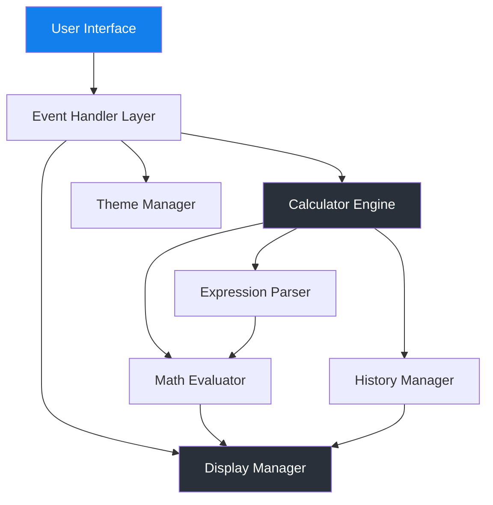

# Technical Specification Document
# Web Mobile Scientific Calculator

**Version**: 1.0  
**Last Updated**: 2025-12-23  
**Status**: Draft  
**Related Documents**: [PRD](file:///c:/Users/WIN/Desktop/calculiator-demo-/document/prd.md)

---

## 1. Executive Summary

본 문서는 웹 모바일 공학용 계산기의 기술적 구현 사양을 정의합니다. 모던 웹 기술을 활용하여 모바일 우선의 반응형 계산기를 구축하며, 성능, 확장성, 유지보수성을 고려한 아키텍처를 제시합니다.

---

## 2. Technology Stack

### 2.1 Core Technologies

#### 2.1.1 Frontend Framework
```yaml
Framework: Vanilla JavaScript (ES6+)
Rationale: 
  - 경량화 및 빠른 로딩 속도
  - 외부 의존성 최소화
  - 간단한 계산기 로직에 적합
  - 번들러 없이 즉시 배포 가능
```

#### 2.1.2 CSS Framework
```yaml
Framework: Tailwind CSS v3.x (CDN)
Version: Latest stable (3.4+)
CDN: https://cdn.tailwindcss.com
Plugins: 
  - forms
  - container-queries
Rationale:
  - 빠른 프로토타이핑
  - 일관된 디자인 시스템
  - 다크 모드 내장 지원
  - 반응형 유틸리티 클래스
```

#### 2.1.3 Typography & Icons
```yaml
Fonts:
  - Family: Inter
    Weights: 400, 500, 600, 700
    Source: Google Fonts
    URL: https://fonts.googleapis.com/css2?family=Inter:wght@400;500;600;700&display=swap
    
Icons:
  - Library: Material Symbols Outlined
    Source: Google Fonts
    URL: https://fonts.googleapis.com/css2?family=Material+Symbols+Outlined:wght,FILL@100..700,0..1&display=swap
    Usage: history, backspace 아이콘
```

### 2.2 Development Tools

#### 2.2.1 Version Control
```yaml
System: Git
Platform: GitHub / GitLab
Branching Strategy: 
  - main: 프로덕션 브랜치
  - develop: 개발 브랜치
  - feature/*: 기능 개발 브랜치
```

#### 2.2.2 Code Editor
```yaml
Recommended: VS Code
Extensions:
  - Tailwind CSS IntelliSense
  - ESLint
  - Prettier
  - Live Server
```

#### 2.2.3 Testing Tools
```yaml
Unit Testing: Jest (선택적)
E2E Testing: Playwright / Cypress (선택적)
Manual Testing: 브라우저 DevTools
```

### 2.3 Deployment

#### 2.3.1 Hosting Options
```yaml
Option 1: GitHub Pages
  - 무료 호스팅
  - 자동 배포 (GitHub Actions)
  - HTTPS 기본 지원
  
Option 2: Vercel / Netlify
  - 무료 티어 제공
  - 자동 배포
  - 커스텀 도메인 지원
  - 성능 최적화
  
Option 3: Static Web Server
  - Nginx / Apache
  - 자체 서버 호스팅
```

---

## 3. Architecture Design

### 3.1 System Architecture



### 3.2 Module Structure

```
calculator/
├── index.html              # 메인 HTML 파일
├── css/
│   └── styles.css          # 커스텀 CSS (Tailwind 보완)
├── js/
│   ├── main.js             # 앱 초기화 및 이벤트 바인딩
│   ├── calculator.js       # 계산기 엔진 (핵심 로직)
│   ├── parser.js           # 수식 파싱 및 검증
│   ├── evaluator.js        # 수학 연산 평가
│   ├── display.js          # 디스플레이 관리
│   ├── history.js          # 계산 이력 관리
│   ├── theme.js            # 테마 관리
│   └── constants.js        # 상수 정의 (π, e 등)
├── assets/
│   └── icons/              # 커스텀 아이콘 (필요시)
└── README.md
```

### 3.3 Component Architecture

#### 3.3.1 Core Components

```javascript
// 1. Calculator Engine
class Calculator {
  constructor()
  input(value)              // 입력 처리
  calculate()               // 계산 실행
  clear()                   // 전체 삭제
  backspace()               // 한 글자 삭제
  setAngleMode(mode)        // RAD/DEG 설정
  getState()                // 현재 상태 반환
}

// 2. Expression Parser
class ExpressionParser {
  parse(expression)         // 수식 파싱
  validate(expression)      // 수식 검증
  tokenize(expression)      // 토큰화
  infixToPostfix(tokens)    // 중위 표기법 → 후위 표기법
}

// 3. Math Evaluator
class MathEvaluator {
  evaluate(postfix, angleMode)  // 후위 표기법 평가
  executeOperation(op, operands) // 연산 실행
  applyFunction(func, value)     // 함수 적용
}

// 4. Display Manager
class DisplayManager {
  updateExpression(expr)    // 수식 표시 업데이트
  updateResult(result)      // 결과 표시 업데이트
  showError(message)        // 오류 메시지 표시
  clear()                   // 디스플레이 초기화
}

// 5. History Manager
class HistoryManager {
  add(expression, result)   // 이력 추가
  get(index)                // 이력 조회
  getAll()                  // 전체 이력 조회
  clear()                   // 이력 삭제
  save()                    // 로컬 스토리지 저장
  load()                    // 로컬 스토리지 로드
}

// 6. Theme Manager
class ThemeManager {
  init()                    // 테마 초기화
  toggle()                  // 테마 전환
  setTheme(theme)           // 테마 설정 ('light' | 'dark')
  getSystemTheme()          // 시스템 테마 감지
}
```

---

## 4. Data Models

### 4.1 Calculator State

```typescript
interface CalculatorState {
  currentExpression: string;      // 현재 수식
  currentResult: string | number; // 현재 결과
  angleMode: 'RAD' | 'DEG';       // 각도 모드
  lastOperation: string | null;   // 마지막 연산
  isError: boolean;               // 오류 상태
  errorMessage: string | null;    // 오류 메시지
}
```

### 4.2 History Entry

```typescript
interface HistoryEntry {
  id: string;                     // 고유 ID (timestamp)
  expression: string;             // 계산식
  result: number | string;        // 결과
  timestamp: number;              // 생성 시간
  angleMode: 'RAD' | 'DEG';       // 각도 모드
}
```

### 4.3 Button Configuration

```typescript
interface ButtonConfig {
  id: string;                     // 버튼 ID
  label: string;                  // 표시 텍스트
  value: string;                  // 입력 값
  type: 'number' | 'operator' | 'function' | 'control';
  category: 'basic' | 'scientific' | 'helper';
  action?: () => void;            // 커스텀 액션
}
```

---

## 5. Core Algorithms

### 5.1 Expression Parsing

#### 5.1.1 Tokenization
```javascript
/**
 * 수식을 토큰으로 분리
 * Input: "(12 + 5) × log(10)"
 * Output: ['(', '12', '+', '5', ')', '×', 'log', '(', '10', ')']
 */
function tokenize(expression) {
  const tokens = [];
  const regex = /(\d+\.?\d*|[+\-×÷^!()]|sin|cos|tan|log|ln|√|π|e)/g;
  let match;
  
  while ((match = regex.exec(expression)) !== null) {
    tokens.push(match[0]);
  }
  
  return tokens;
}
```

#### 5.1.2 Infix to Postfix Conversion (Shunting Yard Algorithm)
```javascript
/**
 * 중위 표기법을 후위 표기법으로 변환
 * Input: ['12', '+', '5', '×', '3']
 * Output: ['12', '5', '3', '×', '+']
 */
function infixToPostfix(tokens) {
  const output = [];
  const operators = [];
  const precedence = {
    '+': 1, '-': 1,
    '×': 2, '÷': 2,
    '^': 3,
    'sin': 4, 'cos': 4, 'tan': 4,
    'log': 4, 'ln': 4, '√': 4
  };
  
  for (const token of tokens) {
    if (isNumber(token)) {
      output.push(token);
    } else if (isFunction(token)) {
      operators.push(token);
    } else if (token === '(') {
      operators.push(token);
    } else if (token === ')') {
      while (operators.length && operators[operators.length - 1] !== '(') {
        output.push(operators.pop());
      }
      operators.pop(); // Remove '('
      if (operators.length && isFunction(operators[operators.length - 1])) {
        output.push(operators.pop());
      }
    } else if (isOperator(token)) {
      while (
        operators.length &&
        precedence[operators[operators.length - 1]] >= precedence[token]
      ) {
        output.push(operators.pop());
      }
      operators.push(token);
    }
  }
  
  while (operators.length) {
    output.push(operators.pop());
  }
  
  return output;
}
```

### 5.2 Expression Evaluation

```javascript
/**
 * 후위 표기법 수식 평가
 */
function evaluatePostfix(postfix, angleMode = 'DEG') {
  const stack = [];
  
  for (const token of postfix) {
    if (isNumber(token)) {
      stack.push(parseFloat(token));
    } else if (isOperator(token)) {
      const b = stack.pop();
      const a = stack.pop();
      stack.push(applyOperator(token, a, b));
    } else if (isFunction(token)) {
      const value = stack.pop();
      stack.push(applyFunction(token, value, angleMode));
    }
  }
  
  return stack[0];
}

function applyOperator(op, a, b) {
  switch (op) {
    case '+': return a + b;
    case '-': return a - b;
    case '×': return a * b;
    case '÷': 
      if (b === 0) throw new Error('Division by zero');
      return a / b;
    case '^': return Math.pow(a, b);
    default: throw new Error(`Unknown operator: ${op}`);
  }
}

function applyFunction(func, value, angleMode) {
  // 각도 변환
  const toRadians = (deg) => deg * Math.PI / 180;
  const angle = angleMode === 'DEG' ? toRadians(value) : value;
  
  switch (func) {
    case 'sin': return Math.sin(angle);
    case 'cos': return Math.cos(angle);
    case 'tan': return Math.tan(angle);
    case 'log': return Math.log10(value);
    case 'ln': return Math.log(value);
    case '√': return Math.sqrt(value);
    case '!': return factorial(value);
    default: throw new Error(`Unknown function: ${func}`);
  }
}

function factorial(n) {
  if (n < 0 || !Number.isInteger(n)) {
    throw new Error('Factorial requires non-negative integer');
  }
  if (n === 0 || n === 1) return 1;
  let result = 1;
  for (let i = 2; i <= n; i++) {
    result *= i;
  }
  return result;
}
```

### 5.3 Number Formatting

```javascript
/**
 * 결과 숫자 포맷팅
 */
function formatResult(value) {
  // 정수인 경우
  if (Number.isInteger(value)) {
    return value.toString();
  }
  
  // 매우 큰 수 또는 매우 작은 수
  if (Math.abs(value) > 1e10 || (Math.abs(value) < 1e-6 && value !== 0)) {
    return value.toExponential(6);
  }
  
  // 일반 소수
  return parseFloat(value.toFixed(10)).toString();
}
```

---

## 6. UI Implementation Details

### 6.1 Tailwind Configuration

```javascript
// Embedded in index.html
tailwind.config = {
  darkMode: "class",
  theme: {
    extend: {
      colors: {
        "primary": "#137fec",
        "background-light": "#f6f7f8",
        "background-dark": "#101922",
        "surface-dark": "#1E2630",
        "surface-accent": "#283039",
      },
      fontFamily: {
        "display": ["Inter", "sans-serif"]
      },
      borderRadius: {
        "DEFAULT": "0.25rem",
        "lg": "0.5rem",
        "xl": "0.75rem",
        "2xl": "1rem",
        "full": "9999px"
      },
    },
  },
}
```

### 6.2 Custom CSS

```css
/* styles.css */

/* Scrollbar 숨김 */
.no-scrollbar::-webkit-scrollbar {
  display: none;
}
.no-scrollbar {
  -ms-overflow-style: none;
  scrollbar-width: none;
}

/* 터치 피드백 */
button:active {
  transform: scale(0.96);
  transition: transform 0.05s ease;
}

/* 최소 높이 보장 */
body {
  min-height: max(884px, 100dvh);
}

/* 결과 애니메이션 */
.result-update {
  animation: fadeIn 0.2s ease-in-out;
}

@keyframes fadeIn {
  from {
    opacity: 0.5;
    transform: translateY(-5px);
  }
  to {
    opacity: 1;
    transform: translateY(0);
  }
}

/* 오류 상태 */
.error-shake {
  animation: shake 0.3s ease-in-out;
}

@keyframes shake {
  0%, 100% { transform: translateX(0); }
  25% { transform: translateX(-10px); }
  75% { transform: translateX(10px); }
}
```

### 6.3 Responsive Breakpoints

```css
/* Tailwind 기본 브레이크포인트 사용 */
sm: 640px   /* 작은 태블릿 */
md: 768px   /* 태블릿 */
lg: 1024px  /* 작은 데스크톱 */
xl: 1280px  /* 데스크톱 */
2xl: 1536px /* 큰 데스크톱 */

/* 주요 조정 포인트 */
- 320px ~ 767px: 모바일 (기본)
- 768px ~ 1023px: 태블릿 (버튼 크기 증가)
- 1024px+: 데스크톱 (최대 너비 제한)
```

---

## 7. Event Handling

### 7.1 Button Events

```javascript
// Event delegation for better performance
document.querySelector('.keypad').addEventListener('click', (e) => {
  const button = e.target.closest('button');
  if (!button) return;
  
  const { type, value, action } = button.dataset;
  
  switch (type) {
    case 'number':
      calculator.input(value);
      break;
    case 'operator':
      calculator.input(value);
      break;
    case 'function':
      calculator.input(value + '(');
      break;
    case 'control':
      if (action === 'calculate') calculator.calculate();
      else if (action === 'clear') calculator.clear();
      else if (action === 'backspace') calculator.backspace();
      break;
  }
  
  updateDisplay();
});
```

### 7.2 Keyboard Support

```javascript
document.addEventListener('keydown', (e) => {
  const keyMap = {
    '0': '0', '1': '1', '2': '2', '3': '3', '4': '4',
    '5': '5', '6': '6', '7': '7', '8': '8', '9': '9',
    '+': '+', '-': '-', '*': '×', '/': '÷',
    'Enter': '=',
    'Escape': 'AC',
    'Backspace': 'backspace',
    '.': '.',
    '(': '(', ')': ')',
  };
  
  const mapped = keyMap[e.key];
  if (!mapped) return;
  
  e.preventDefault();
  
  if (mapped === '=') calculator.calculate();
  else if (mapped === 'AC') calculator.clear();
  else if (mapped === 'backspace') calculator.backspace();
  else calculator.input(mapped);
  
  updateDisplay();
});
```

### 7.3 Theme Toggle

```javascript
// 시스템 테마 감지
const prefersDark = window.matchMedia('(prefers-color-scheme: dark)');

function initTheme() {
  const savedTheme = localStorage.getItem('theme');
  const theme = savedTheme || (prefersDark.matches ? 'dark' : 'light');
  setTheme(theme);
}

function setTheme(theme) {
  if (theme === 'dark') {
    document.documentElement.classList.add('dark');
  } else {
    document.documentElement.classList.remove('dark');
  }
  localStorage.setItem('theme', theme);
}

// 시스템 테마 변경 감지
prefersDark.addEventListener('change', (e) => {
  if (!localStorage.getItem('theme')) {
    setTheme(e.matches ? 'dark' : 'light');
  }
});
```

---

## 8. State Management

### 8.1 Calculator State

```javascript
class CalculatorState {
  constructor() {
    this.reset();
  }
  
  reset() {
    this.expression = '';
    this.result = '0';
    this.angleMode = 'DEG';
    this.isError = false;
    this.errorMessage = null;
    this.lastCalculation = null;
  }
  
  setExpression(expr) {
    this.expression = expr;
    this.isError = false;
  }
  
  setResult(value) {
    this.result = formatResult(value);
    this.lastCalculation = {
      expression: this.expression,
      result: this.result,
      timestamp: Date.now()
    };
  }
  
  setError(message) {
    this.isError = true;
    this.errorMessage = message;
    this.result = 'Error';
  }
  
  setAngleMode(mode) {
    this.angleMode = mode;
  }
  
  getState() {
    return {
      expression: this.expression,
      result: this.result,
      angleMode: this.angleMode,
      isError: this.isError,
      errorMessage: this.errorMessage
    };
  }
}
```

### 8.2 History State

```javascript
class HistoryState {
  constructor(maxEntries = 50) {
    this.maxEntries = maxEntries;
    this.entries = this.load();
  }
  
  add(expression, result, angleMode) {
    const entry = {
      id: Date.now().toString(),
      expression,
      result,
      angleMode,
      timestamp: Date.now()
    };
    
    this.entries.unshift(entry);
    
    // 최대 개수 제한
    if (this.entries.length > this.maxEntries) {
      this.entries = this.entries.slice(0, this.maxEntries);
    }
    
    this.save();
  }
  
  getAll() {
    return this.entries;
  }
  
  clear() {
    this.entries = [];
    this.save();
  }
  
  save() {
    try {
      localStorage.setItem('calculator-history', JSON.stringify(this.entries));
    } catch (e) {
      console.error('Failed to save history:', e);
    }
  }
  
  load() {
    try {
      const saved = localStorage.getItem('calculator-history');
      return saved ? JSON.parse(saved) : [];
    } catch (e) {
      console.error('Failed to load history:', e);
      return [];
    }
  }
}
```

---

## 9. Error Handling

### 9.1 Error Types

```javascript
class CalculatorError extends Error {
  constructor(type, message) {
    super(message);
    this.type = type;
    this.name = 'CalculatorError';
  }
}

const ErrorTypes = {
  SYNTAX_ERROR: 'SYNTAX_ERROR',
  MATH_ERROR: 'MATH_ERROR',
  DOMAIN_ERROR: 'DOMAIN_ERROR',
  OVERFLOW_ERROR: 'OVERFLOW_ERROR'
};

// 사용 예시
function validateExpression(expr) {
  if (!isBalancedParentheses(expr)) {
    throw new CalculatorError(
      ErrorTypes.SYNTAX_ERROR,
      'Unbalanced parentheses'
    );
  }
}
```

### 9.2 Error Messages

```javascript
const ErrorMessages = {
  SYNTAX_ERROR: '구문 오류',
  MATH_ERROR: '수학 오류',
  DIVISION_BY_ZERO: '0으로 나눌 수 없습니다',
  DOMAIN_ERROR: '정의되지 않은 값',
  OVERFLOW_ERROR: '결과가 너무 큽니다',
  INVALID_INPUT: '잘못된 입력',
  FACTORIAL_ERROR: '팩토리얼은 음이 아닌 정수만 가능합니다'
};
```

### 9.3 Error Recovery

```javascript
function safeCalculate() {
  try {
    const result = calculator.calculate();
    displayManager.updateResult(result);
    historyManager.add(calculator.expression, result);
  } catch (error) {
    if (error instanceof CalculatorError) {
      displayManager.showError(ErrorMessages[error.type] || error.message);
    } else {
      displayManager.showError(ErrorMessages.MATH_ERROR);
      console.error('Unexpected error:', error);
    }
    
    // 오류 애니메이션
    displayManager.shakeDisplay();
  }
}
```

---

## 10. Performance Optimization

### 10.1 Lazy Loading

```javascript
// 히스토리 패널은 필요할 때만 렌더링
let historyPanel = null;

function showHistory() {
  if (!historyPanel) {
    historyPanel = createHistoryPanel();
    document.body.appendChild(historyPanel);
  }
  historyPanel.classList.add('active');
  renderHistoryEntries();
}
```

### 10.2 Debouncing

```javascript
// 연속 입력 시 디스플레이 업데이트 최적화
function debounce(func, wait) {
  let timeout;
  return function executedFunction(...args) {
    const later = () => {
      clearTimeout(timeout);
      func(...args);
    };
    clearTimeout(timeout);
    timeout = setTimeout(later, wait);
  };
}

const debouncedUpdate = debounce(updateDisplay, 50);
```

### 10.3 Memoization

```javascript
// 복잡한 계산 결과 캐싱
const memoize = (fn) => {
  const cache = new Map();
  return (...args) => {
    const key = JSON.stringify(args);
    if (cache.has(key)) {
      return cache.get(key);
    }
    const result = fn(...args);
    cache.set(key, result);
    return result;
  };
};

const memoizedFactorial = memoize(factorial);
```

---

## 11. Testing Strategy

### 11.1 Unit Tests

```javascript
// Jest 테스트 예시
describe('Calculator Engine', () => {
  let calculator;
  
  beforeEach(() => {
    calculator = new Calculator();
  });
  
  test('basic addition', () => {
    calculator.input('5');
    calculator.input('+');
    calculator.input('3');
    const result = calculator.calculate();
    expect(result).toBe(8);
  });
  
  test('trigonometric functions in DEG mode', () => {
    calculator.setAngleMode('DEG');
    calculator.input('sin(30)');
    const result = calculator.calculate();
    expect(result).toBeCloseTo(0.5, 5);
  });
  
  test('division by zero error', () => {
    calculator.input('5÷0');
    expect(() => calculator.calculate()).toThrow(CalculatorError);
  });
});
```

### 11.2 Integration Tests

```javascript
describe('Display Integration', () => {
  test('updates display after calculation', () => {
    calculator.input('2+2');
    calculator.calculate();
    const displayValue = displayManager.getResult();
    expect(displayValue).toBe('4');
  });
});
```

### 11.3 Manual Test Cases

```markdown
## 기본 연산 테스트
- [ ] 2 + 2 = 4
- [ ] 10 - 5 = 5
- [ ] 3 × 4 = 12
- [ ] 15 ÷ 3 = 5
- [ ] 2.5 + 3.7 = 6.2

## 과학 함수 테스트
- [ ] sin(30°) = 0.5
- [ ] cos(0°) = 1
- [ ] tan(45°) = 1
- [ ] log(100) = 2
- [ ] ln(e) = 1
- [ ] √16 = 4
- [ ] 5! = 120

## 복합 연산 테스트
- [ ] (2 + 3) × 4 = 20
- [ ] 2^3 + 1 = 9
- [ ] sin(30) + cos(60) = 1

## 오류 처리 테스트
- [ ] 5 ÷ 0 → Error
- [ ] √(-1) → Error
- [ ] (-5)! → Error
- [ ] Unbalanced parentheses → Error
```

---

## 12. Security Considerations

### 12.1 Input Validation

```javascript
function sanitizeInput(input) {
  // 허용된 문자만 통과
  const allowedChars = /^[0-9+\-×÷^!().πe\s]+$/;
  if (!allowedChars.test(input)) {
    throw new CalculatorError(ErrorTypes.INVALID_INPUT, 'Invalid characters');
  }
  return input;
}
```

### 12.2 XSS Prevention

```javascript
// 디스플레이 업데이트 시 textContent 사용 (innerHTML 금지)
function updateDisplay(value) {
  displayElement.textContent = value; // Safe
  // displayElement.innerHTML = value; // NEVER do this
}
```

### 12.3 LocalStorage Safety

```javascript
function safeLocalStorage() {
  try {
    const test = '__storage_test__';
    localStorage.setItem(test, test);
    localStorage.removeItem(test);
    return true;
  } catch (e) {
    console.warn('LocalStorage not available:', e);
    return false;
  }
}
```

---

## 13. Accessibility (A11y)

### 13.1 ARIA Labels

```html
<!-- 버튼 접근성 -->
<button 
  aria-label="Number 7"
  data-type="number"
  data-value="7"
>7</button>

<button 
  aria-label="Sine function"
  data-type="function"
  data-value="sin"
>sin</button>

<button 
  aria-label="Calculate result"
  data-type="control"
  data-action="calculate"
>=</button>

<!-- 디스플레이 접근성 -->
<div 
  role="status" 
  aria-live="polite" 
  aria-label="Calculation result"
>
  <h1>17</h1>
</div>
```

### 13.2 Keyboard Navigation

```javascript
// Tab 순서 관리
const focusableElements = [
  '.history-button',
  '.angle-mode-toggle',
  '.keypad button'
];

// Focus trap in modal
function trapFocus(element) {
  const focusable = element.querySelectorAll(
    'button, [href], input, select, textarea, [tabindex]:not([tabindex="-1"])'
  );
  const first = focusable[0];
  const last = focusable[focusable.length - 1];
  
  element.addEventListener('keydown', (e) => {
    if (e.key !== 'Tab') return;
    
    if (e.shiftKey && document.activeElement === first) {
      e.preventDefault();
      last.focus();
    } else if (!e.shiftKey && document.activeElement === last) {
      e.preventDefault();
      first.focus();
    }
  });
}
```

### 13.3 Color Contrast

```css
/* WCAG AA 준수 (최소 4.5:1) */
/* 라이트 모드 */
--text-on-light: #0f172a;      /* 검정 on 밝은 배경 */
--primary-on-light: #137fec;   /* 파란색 on 밝은 배경 */

/* 다크 모드 */
--text-on-dark: #ffffff;       /* 흰색 on 어두운 배경 */
--primary-on-dark: #3b9eff;    /* 밝은 파란색 on 어두운 배경 */
```

---

## 14. Browser Compatibility

### 14.1 Target Browsers

```yaml
Chrome/Edge: >= 90 (2021+)
Safari: >= 14 (2020+)
Firefox: >= 88 (2021+)
Mobile Safari: >= 14
Chrome Android: >= 90
```

### 14.2 Required Features

```javascript
// ES6+ Features Used
- const/let
- Arrow functions
- Template literals
- Destructuring
- Classes
- Modules (optional)
- Array methods (map, filter, reduce)
- Math methods

// CSS Features
- CSS Grid
- Flexbox
- CSS Variables (custom properties)
- Dark mode (prefers-color-scheme)
- dvh units (with fallback)
```

### 14.3 Polyfills (if needed)

```html
<!-- 구형 브라우저 지원 시 -->
<script src="https://polyfill.io/v3/polyfill.min.js?features=es6"></script>
```

---

## 15. Deployment Specification

### 15.1 Build Process

#### 15.1.1 Development Environment
```bash
# 로컬 개발 서버 실행
# Option 1: Live Server (VS Code Extension)
# - VS Code에서 index.html 우클릭 → "Open with Live Server"

# Option 2: Python Simple HTTP Server
python -m http.server 8000

# Option 3: Node.js http-server
npx http-server -p 8000
```

#### 15.1.2 Production Build
본 프로젝트는 Vanilla JavaScript와 Tailwind CDN을 사용하므로 별도의 빌드 과정이 필요하지 않습니다. 
정적 파일을 그대로 배포합니다.

```bash
# 배포 전 체크리스트
# 1. HTML 파일 검증
# 2. JavaScript 문법 체크 (ESLint)
# 3. 브라우저 테스트
# 4. 성능 테스트 (Lighthouse)
```

### 15.2 GitHub Actions CI/CD

#### 15.2.1 Workflow Configuration
GitHub Actions를 사용하여 자동 빌드 및 배포를 수행합니다.

**워크플로우 파일**: `.github/workflows/deploy.yml`

```yaml
name: Deploy to GitHub Pages

on:
  push:
    branches: [ main ]
  pull_request:
    branches: [ main ]
  workflow_dispatch:  # 수동 실행 허용

permissions:
  contents: read
  pages: write
  id-token: write

concurrency:
  group: "pages"
  cancel-in-progress: false

jobs:
  # 빌드 및 테스트 작업
  build:
    runs-on: ubuntu-latest
    steps:
      - name: Checkout
        uses: actions/checkout@v4
      
      - name: Setup Node.js
        uses: actions/setup-node@v4
        with:
          node-version: '20'
      
      - name: Validate HTML
        run: |
          npx html-validate index.html || true
      
      - name: Run ESLint (if configured)
        run: |
          if [ -f "package.json" ]; then
            npm install
            npm run lint || true
          fi
      
      - name: Setup Pages
        uses: actions/configure-pages@v4
      
      - name: Upload artifact
        uses: actions/upload-pages-artifact@v3
        with:
          path: '.'
  
  # GitHub Pages 배포 작업
  deploy:
    environment:
      name: github-pages
      url: ${{ steps.deployment.outputs.page_url }}
    runs-on: ubuntu-latest
    needs: build
    if: github.ref == 'refs/heads/main'
    steps:
      - name: Deploy to GitHub Pages
        id: deployment
        uses: actions/deploy-pages@v4
```

#### 15.2.2 GitHub Pages 설정

**Repository Settings 구성**:
1. GitHub Repository → Settings → Pages
2. Source: "GitHub Actions" 선택
3. Custom domain (선택사항): 도메인 입력
4. Enforce HTTPS: 체크

**배포 URL**:
```
https://<username>.github.io/<repository-name>/
```

### 15.3 Alternative: Simple Deployment

간단한 배포를 원할 경우 더 단순한 워크플로우 사용:

```yaml
# .github/workflows/simple-deploy.yml
name: Simple Deploy

on:
  push:
    branches: [ main ]

jobs:
  deploy:
    runs-on: ubuntu-latest
    steps:
      - uses: actions/checkout@v4
      
      - name: Deploy to GitHub Pages
        uses: peaceiris/actions-gh-pages@v3
        with:
          github_token: ${{ secrets.GITHUB_TOKEN }}
          publish_dir: ./
          cname: your-domain.com  # 커스텀 도메인 사용 시
```

### 15.3 Environment Variables

```javascript
// config.js
const CONFIG = {
  APP_NAME: 'Scientific Calculator',
  VERSION: '1.0.0',
  MAX_HISTORY_ENTRIES: 50,
  DECIMAL_PRECISION: 10,
  ENABLE_KEYBOARD: true,
  ENABLE_HISTORY: true,
  THEME: 'auto' // 'light' | 'dark' | 'auto'
};
```

---

## 16. Monitoring & Analytics

### 16.1 Error Tracking

```javascript
// 간단한 에러 로깅
window.addEventListener('error', (event) => {
  console.error('Global error:', {
    message: event.message,
    filename: event.filename,
    lineno: event.lineno,
    colno: event.colno,
    error: event.error
  });
  
  // 프로덕션: 에러 리포팅 서비스로 전송
  // sendToErrorTracking(event);
});
```

### 16.2 Usage Analytics (선택적)

```javascript
// Google Analytics 4 예시
function trackCalculation(operation) {
  if (typeof gtag !== 'undefined') {
    gtag('event', 'calculation', {
      'operation_type': operation,
      'angle_mode': calculator.angleMode
    });
  }
}
```

---

## 17. Code Style Guide

### 17.1 JavaScript Style

```javascript
// ESLint 권장 설정
{
  "extends": "eslint:recommended",
  "env": {
    "browser": true,
    "es6": true
  },
  "rules": {
    "indent": ["error", 2],
    "quotes": ["error", "single"],
    "semi": ["error", "always"],
    "no-console": ["warn", { "allow": ["warn", "error"] }]
  }
}
```

### 17.2 Naming Conventions

```javascript
// Classes: PascalCase
class Calculator {}
class DisplayManager {}

// Functions/Methods: camelCase
function calculateResult() {}
function updateDisplay() {}

// Constants: UPPER_SNAKE_CASE
const MAX_DIGITS = 15;
const ERROR_MESSAGES = {};

// Variables: camelCase
let currentValue = 0;
const angleMode = 'DEG';
```

### 17.3 File Organization

```javascript
// 파일 구조 템플릿
/**
 * @file calculator.js
 * @description 계산기 핵심 엔진
 * @author Your Name
 * @version 1.0.0
 */

// 1. Imports (if using modules)
import { Parser } from './parser.js';

// 2. Constants
const OPERATORS = ['+', '-', '×', '÷'];

// 3. Helper functions
function isOperator(token) { ... }

// 4. Main class/functions
class Calculator { ... }

// 5. Exports (if using modules)
export default Calculator;
```

---

## 18. Documentation

### 18.1 Code Comments

```javascript
/**
 * 수식을 평가하고 결과를 반환합니다.
 * 
 * @param {string} expression - 평가할 수식
 * @param {string} angleMode - 각도 모드 ('RAD' | 'DEG')
 * @returns {number} 계산 결과
 * @throws {CalculatorError} 수식이 유효하지 않은 경우
 * 
 * @example
 * evaluate('2 + 2', 'DEG') // returns 4
 * evaluate('sin(30)', 'DEG') // returns 0.5
 */
function evaluate(expression, angleMode) {
  // Implementation
}
```

### 18.2 README Structure

```markdown
# Scientific Calculator

## Features
- Basic arithmetic operations
- Scientific functions
- Dark mode support
- Calculation history

## Installation
1. Clone the repository
2. Open index.html in a browser

## Usage
[Instructions]

## Development
[Setup instructions]

## License
MIT
```

---

## 19. Future Technical Enhancements

### 19.1 Progressive Web App (PWA)

```javascript
// manifest.json
{
  "name": "Scientific Calculator",
  "short_name": "Calculator",
  "start_url": "/",
  "display": "standalone",
  "background_color": "#101922",
  "theme_color": "#137fec",
  "icons": [
    {
      "src": "/icon-192.png",
      "sizes": "192x192",
      "type": "image/png"
    },
    {
      "src": "/icon-512.png",
      "sizes": "512x512",
      "type": "image/png"
    }
  ]
}

// service-worker.js
self.addEventListener('install', (event) => {
  event.waitUntil(
    caches.open('calculator-v1').then((cache) => {
      return cache.addAll([
        '/',
        '/index.html',
        '/css/styles.css',
        '/js/main.js'
      ]);
    })
  );
});
```

### 19.2 Web Workers for Complex Calculations

```javascript
// calculator-worker.js
self.addEventListener('message', (e) => {
  const { expression, angleMode } = e.data;
  try {
    const result = evaluate(expression, angleMode);
    self.postMessage({ success: true, result });
  } catch (error) {
    self.postMessage({ success: false, error: error.message });
  }
});

// main.js
const worker = new Worker('calculator-worker.js');
worker.postMessage({ expression: '2+2', angleMode: 'DEG' });
worker.onmessage = (e) => {
  if (e.data.success) {
    displayResult(e.data.result);
  }
};
```

### 19.3 IndexedDB for Advanced History

```javascript
// 대량의 계산 이력 저장
const dbPromise = indexedDB.open('calculator-db', 1);

dbPromise.onupgradeneeded = (event) => {
  const db = event.target.result;
  db.createObjectStore('history', { keyPath: 'id', autoIncrement: true });
};
```

---

## 20. Appendix

### 20.1 Mathematical Constants

```javascript
const MATH_CONSTANTS = {
  PI: Math.PI,              // 3.141592653589793
  E: Math.E,                // 2.718281828459045
  LN2: Math.LN2,            // 0.6931471805599453
  LN10: Math.LN10,          // 2.302585092994046
  LOG2E: Math.LOG2E,        // 1.4426950408889634
  LOG10E: Math.LOG10E,      // 0.4342944819032518
  SQRT2: Math.SQRT2,        // 1.4142135623730951
};
```

### 20.2 Operator Precedence

```javascript
const PRECEDENCE = {
  '(': 0,
  ')': 0,
  '+': 1,
  '-': 1,
  '×': 2,
  '÷': 2,
  '^': 3,
  '√': 4,
  '!': 4,
  'sin': 5,
  'cos': 5,
  'tan': 5,
  'log': 5,
  'ln': 5,
};
```

### 20.3 Button Layout Map

```javascript
const BUTTON_LAYOUT = [
  // Row 1: Scientific functions
  [
    { label: 'sin', type: 'function', value: 'sin' },
    { label: 'cos', type: 'function', value: 'cos' },
    { label: 'tan', type: 'function', value: 'tan' },
    { label: 'ln', type: 'function', value: 'ln' }
  ],
  // Row 2: Parentheses and operators
  [
    { label: '(', type: 'operator', value: '(' },
    { label: ')', type: 'operator', value: ')' },
    { label: 'log', type: 'function', value: 'log' },
    { label: '÷', type: 'operator', value: '÷' }
  ],
  // ... (계속)
];
```

---

## 21. Approval & Review

### 21.1 Technical Review Checklist
- [ ] Architecture design approved
- [ ] Technology stack confirmed
- [ ] Security considerations reviewed
- [ ] Performance requirements validated
- [ ] Accessibility standards verified
- [ ] Browser compatibility confirmed

### 21.2 Sign-off
- **Tech Lead**: _______________
- **Senior Developer**: _______________
- **Date**: _______________

---

**Document Version**: 1.0  
**Last Updated**: 2025-12-23  
**Author**: Antigravity AI  
**Status**: Draft - Pending Review
